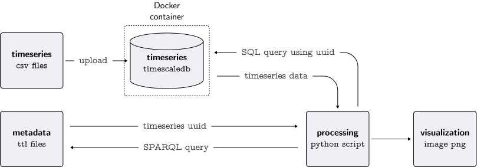

# Brick data retrieval demo using Timescale DB and Docker

This is a tutorial on how to perform queries on `.ttl` brick schema and retrieve
the `uuid` of the relative timeseries froma a `timescaleDB` deployed locally on `docker` container. The following figure
shows an example of result.



In this folder is contained the code referring to the
repository [brick-data-retrieval-demo](https://github.com/gtfierro/brick-data-retrieval-demo) and explained
in [this tutorial video](https://www.youtube.com/watch?v=kZYNXoiM8gk)

## Setup

1. Create virtual environment in the root folder and activate
   ```bash 
   python3 -m venv venv
   ```
2. Install the necessary packages in the virtual environment from the [`requirements.txt`](requirements.txt) file
   ```bash
   pip install -r requirements.txt
   ```

3. Create an `.env` file in the root directory and set up the environmental variables. All the scripts secrets have as
   reference the env file in the root folder and the file should be like the [`example.env`](example.env) file:
   ```bash 
   touch .env
   
   printf "TIMESCALEDB_HOST=localhost
   TIMESCALEDB_PORT=5432
   TIMESCALEDB_USER=postgres
   TIMESCALEDB_PSW=mypassword
   POSTGRES_PASSWORD=mypassword
   VOLUME_NAME=4f31cadb[...]0eab" > .env
   ```

4. Unzip data files contained in `data.zip` with the following command:
    ```bash
    unzip data.zip
    ```

5. Start docker container with timeseries database. This action requires that you have [Docker](https://www.docker.com/)
   installed on your machine. Create a network and a container with a [TimescaleDB](https://www.timescale.com/) by
   running the following command:
    ```bash
    ./scripts/start_docker_containers.sh
    ```
6. Check whether the docker containers are running:
    ```bash
    docker ps
    ```

7. The first time you will load the timeseries data contained in the `data` folder in the TimescaleDB by running the
   following command:
    ```bash
    ./scripts/setup_docker_timescaledb.sh
    ```
   This command creates the database schema and tables based on the script [`schema.sql`](./scripts/schema.sql)

## Operation

There are some useful tips when deploying the services and code development:

1. **Persistence storage**: To avoid to reload the csv files each time you create the container I suggest to
   create a volume to mount every time a new container is created. Once the container is running, get the current volume
   name or mount path with this command:
   ```bash
   docker inspect timescaledb --format='{{range .Mounts }}{{.Name}}{{end}}'
   # should be something like -> 069ba64815f0c26783b81a5f0ca813227fde8491f429cf77ed9a5ae3536c0b2c
   ```
   Copy the volume name in the `VOLUME_NAME` environment variable in the `.env` file. Now you know the name of the
   volume, and you can mount it on the next run using the following script.
   ```bash
   ./scripts/start_docker_containers.sh
   ```

2. **Requirements**: Export requirements using `pipreqs` that scans the `.py` files in the project and generates
   the `requirements.txt` file the file. I prefer using this method instead of `pip freeze` to avoid to list unnecessary
   or conflicting requirements
   ```bash
   pipreqs . --force
   ```

3. **Shutdown**: The `scripts/cleanup.sh` script will delete the docker containers and network once you finished.
   ```bash
   ./scripts/cleanup_docker_containers.sh
   ```

## Data analysis

The data exploration process is performed through the python script [`main.py`](main.py). A basic sparql query on
the brick schema and data retrieval from the timescale db is performed. Feel free to change the query, parameters and
variables to get different timeseries.


